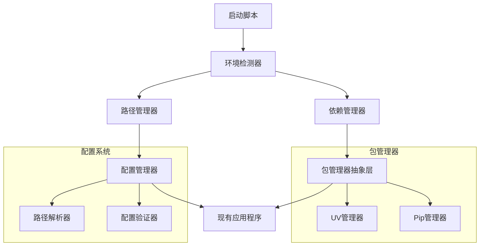

# 设计文档

## 概述

本设计旨在将现有的视频下载器项目转换为高度可移植的应用程序，支持跨平台部署和现代Python包管理。设计采用模块化架构，通过环境检测、路径管理、依赖管理和启动脚本等组件实现完全的可移植性。

## 架构

### 核心组件架构



### 文件结构设计

```
project-root/
├── pyproject.toml          # uv项目配置
├── requirements.txt        # pip回退支持
├── setup.py               # 安装脚本
├── start.bat              # Windows启动脚本
├── start.sh               # Linux/Mac启动脚本
├── portable/              # 可移植性模块
│   ├── __init__.py
│   ├── env_checker.py     # 环境检测
│   ├── path_manager.py    # 路径管理
│   ├── dep_manager.py     # 依赖管理
│   └── config_manager.py  # 配置管理
├── config/                # 配置模板
│   └── default_config.json
└── [现有文件保持不变]
```

## 组件和接口

### 1. 环境检测器 (EnvChecker)

**职责：** 检测运行环境并验证系统要求

**接口：**
```python
class EnvChecker:
    def check_python_version(self) -> bool
    def check_system_requirements(self) -> Dict[str, bool]
    def check_package_managers(self) -> Dict[str, bool]
    def generate_report(self) -> str
    def auto_fix_issues(self) -> bool
```

**关键功能：**
- Python版本检测（>=3.8）
- 系统平台识别
- uv/pip可用性检测
- 必要目录结构验证

### 2. 路径管理器 (PathManager)

**职责：** 处理所有路径相关操作，确保跨平台兼容性

**接口：**
```python
class PathManager:
    def get_project_root(self) -> Path
    def resolve_relative_path(self, path: str) -> Path
    def ensure_directory_exists(self, path: Path) -> bool
    def convert_to_relative(self, absolute_path: str) -> str
    def normalize_config_paths(self, config: dict) -> dict
```

**关键功能：**
- 自动检测项目根目录
- 相对路径解析和转换
- 跨平台路径标准化
- 配置文件路径自动修正

### 3. 依赖管理器 (DependencyManager)

**职责：** 管理Python包依赖，支持uv和pip

**接口：**
```python
class DependencyManager:
    def detect_package_manager(self) -> str
    def install_dependencies(self) -> bool
    def check_dependencies(self) -> Dict[str, bool]
    def generate_pyproject_toml(self) -> bool
    def migrate_from_requirements_txt(self) -> bool
```

**关键功能：**
- 优先使用uv，回退到pip
- 自动生成pyproject.toml
- 依赖安装和验证
- 从requirements.txt迁移

### 4. 配置管理器 (ConfigManager)

**职责：** 管理应用程序配置，确保路径可移植性

**接口：**
```python
class ConfigManager:
    def load_config(self, config_path: str) -> dict
    def save_config(self, config: dict, config_path: str) -> bool
    def normalize_paths(self, config: dict) -> dict
    def create_default_config(self) -> dict
    def validate_config(self, config: dict) -> bool
```

**关键功能：**
- 配置文件路径标准化
- 默认配置生成
- 配置验证和修复
- 相对路径转换

## 数据模型

### 环境信息模型
```python
@dataclass
class EnvironmentInfo:
    python_version: str
    platform: str
    project_root: Path
    package_manager: str
    dependencies_status: Dict[str, bool]
    config_status: bool
    directories_status: Dict[str, bool]
```

### 配置模型
```python
@dataclass
class PortableConfig:
    project_root: Path
    output_dir: Path
    logs_dir: Path
    cookies_dir: Path
    config_file: Path
    dependencies: List[str]
    package_manager: str
```

## 错误处理

### 错误分类和处理策略

1. **环境错误**
   - Python版本不兼容：提供升级指导
   - 包管理器缺失：提供安装指导
   - 权限问题：提供解决方案

2. **路径错误**
   - 目录不存在：自动创建
   - 权限不足：提示用户
   - 路径格式错误：自动修正

3. **依赖错误**
   - 包缺失：自动安装
   - 版本冲突：提供解决建议
   - 网络问题：提供离线解决方案

4. **配置错误**
   - 配置文件损坏：重新生成
   - 路径无效：自动修正
   - 格式错误：验证和修复

### 错误恢复机制

```python
class ErrorRecovery:
    def handle_missing_dependencies(self) -> bool
    def handle_path_issues(self) -> bool
    def handle_config_corruption(self) -> bool
    def create_backup_config(self) -> bool
    def restore_from_backup(self) -> bool
```

## 测试策略

### 单元测试
- 每个组件的独立功能测试
- 路径处理逻辑测试
- 配置解析和验证测试
- 错误处理测试

### 集成测试
- 完整启动流程测试
- 跨平台兼容性测试
- 不同Python版本测试
- 包管理器切换测试

### 可移植性测试
- 不同目录位置测试
- 不同操作系统测试
- 清洁环境部署测试
- 配置迁移测试

### 测试环境设置

```python
class PortabilityTestSuite:
    def test_clean_deployment(self)
    def test_path_migration(self)
    def test_dependency_management(self)
    def test_config_portability(self)
    def test_cross_platform_compatibility(self)
```

## 实现细节

### pyproject.toml 结构
```toml
[project]
name = "universal-video-downloader"
version = "1.0.0"
description = "Universal multi-platform video downloader"
requires-python = ">=3.8"
dependencies = [
    "yt-dlp>=2024.11.04",
    "PyQt6>=6.0.0; platform_system!='Darwin'",
    "PySide6>=6.0.0; platform_system=='Darwin'"
]

[project.optional-dependencies]
dev = ["pytest", "black", "flake8"]

[build-system]
requires = ["setuptools>=45", "wheel"]
build-backend = "setuptools.build_meta"

[tool.uv]
dev-dependencies = [
    "pytest>=7.0.0",
    "black>=22.0.0"
]
```

### 启动脚本逻辑

**Windows (start.bat):**
```batch
@echo off
cd /d "%~dp0"
python portable\env_checker.py
if %errorlevel% neq 0 exit /b %errorlevel%
python gui_downloader.py
```

**Linux/Mac (start.sh):**
```bash
#!/bin/bash
cd "$(dirname "$0")"
python3 portable/env_checker.py
if [ $? -ne 0 ]; then exit $?; fi
python3 gui_downloader.py
```

### 配置迁移策略

1. **检测现有配置**
   - 扫描绝对路径引用
   - 识别需要转换的配置项

2. **路径转换**
   - 绝对路径 → 相对路径
   - 平台特定路径 → 通用路径

3. **配置备份**
   - 保存原始配置
   - 创建迁移日志

4. **验证和测试**
   - 验证转换后的配置
   - 测试功能完整性

### 包管理器抽象层

```python
class PackageManagerInterface:
    def install(self, packages: List[str]) -> bool
    def check_installed(self, package: str) -> bool
    def list_installed(self) -> List[str]
    def get_version(self, package: str) -> str

class UvManager(PackageManagerInterface):
    # uv specific implementation
    
class PipManager(PackageManagerInterface):
    # pip specific implementation
```

这个设计确保了项目的高度可移植性，同时保持了与现有代码的兼容性，并提供了现代化的依赖管理体验。