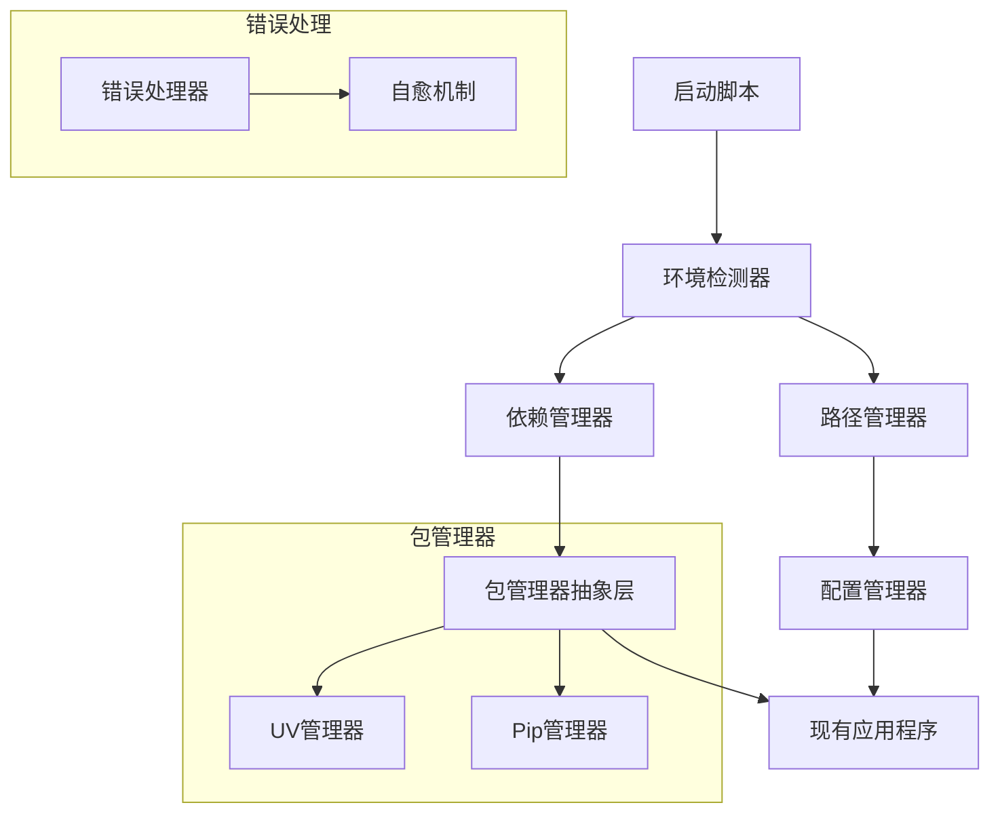

# 🛠️ 开发者文档

Universal Video Downloader 可移植性模块开发指南

## 🏗️ 架构概览

### 核心设计理念
- **Apple式用户体验** - 开箱即用，静默智能
- **可移植性优先** - 任何位置都能运行
- **错误自愈** - 自动检测和修复问题
- **现代包管理** - UV优先，Pip回退

### 模块架构图



## 📦 核心模块

### 1. 环境检测器 (`env_checker.py`)

**职责**: 检测运行环境并验证系统要求

```python
from portable.env_checker import EnvChecker

# 创建检测器
checker = EnvChecker(silent=False)

# 执行完整检查
env_info = checker.check_all()

# 自动修复问题
if checker.warnings:
    checker.auto_fix_issues()
```

**关键方法**:
- `check_all()` - 执行完整环境检查
- `auto_fix_issues()` - 自动修复可修复的问题
- `get_errors()` - 获取错误列表
- `has_critical_errors()` - 检查是否有严重错误

### 2. 路径管理器 (`path_manager.py`)

**职责**: 处理所有路径相关操作，确保跨平台兼容性

```python
from portable.path_manager import PathManager

# 创建路径管理器
path_manager = PathManager(silent=False)

# 获取项目根目录
root = path_manager.get_project_root()

# 解析相对路径
abs_path = path_manager.resolve_relative_path("./downloads")

# 转换为相对路径
rel_path = path_manager.convert_to_relative("/absolute/path")
```

**关键方法**:
- `get_project_root()` - 获取项目根目录
- `resolve_relative_path()` - 解析相对路径
- `convert_to_relative()` - 转换为相对路径
- `normalize_path()` - 标准化路径格式
- `create_project_directories()` - 创建项目目录结构

### 3. 依赖管理器 (`dep_manager.py`)

**职责**: 管理Python包依赖，支持uv和pip

```python
from portable.dep_manager import DependencyManager

# 创建依赖管理器
dep_manager = DependencyManager(silent=False)

# 检查依赖状态
status = dep_manager.check_dependencies()

# 安装依赖
success = dep_manager.install_dependencies()

# 生成pyproject.toml
dep_manager.generate_pyproject_toml()
```

**包管理器抽象层**:
```python
from portable.dep_manager import UvManager, PipManager

# UV管理器
uv_manager = UvManager()
if uv_manager.is_available():
    uv_manager.install(["yt-dlp"])

# Pip管理器
pip_manager = PipManager()
pip_manager.check_installed("yt-dlp")
```

### 4. 配置管理器 (`config_manager.py`)

**职责**: 管理应用程序配置，确保路径可移植性

```python
from portable.config_manager import ConfigManager

# 创建配置管理器
config_manager = ConfigManager(silent=False)

# 加载配置
config = config_manager.load_config()

# 保存配置
config_manager.save_config(config)

# 迁移配置
config_manager.migrate_config()
```

**关键功能**:
- 自动路径标准化
- 配置验证和修复
- 默认配置生成
- 配置备份和恢复

### 5. 错误处理器 (`error_handler.py`)

**职责**: 提供用户友好的错误处理和自动修复

```python
from portable.error_handler import ErrorHandler, global_error_handler

# 处理错误列表
errors = [error1, error2, error3]
global_error_handler.handle_errors(errors)

# 自动修复
global_error_handler.auto_fix_errors(errors)

# 显示错误摘要
global_error_handler.show_error_summary(errors)
```

## 🔧 扩展开发

### 添加新的包管理器

1. 继承 `PackageManagerInterface`:

```python
from portable.dep_manager import PackageManagerInterface

class CustomManager(PackageManagerInterface):
    def is_available(self) -> bool:
        # 检查管理器是否可用
        pass
    
    def install(self, packages: List[str]) -> bool:
        # 安装包的实现
        pass
    
    def check_installed(self, package: str) -> bool:
        # 检查包是否已安装
        pass
```

2. 注册到依赖管理器:

```python
# 在 DependencyManager._detect_package_manager() 中添加检测逻辑
```

### 添加新的错误处理器

```python
from portable.error_handler import global_error_handler

# 注册错误处理器
def handle_custom_error(error):
    print(f"处理自定义错误: {error.message}")
    return True

global_error_handler.register_error_handler("custom_error", handle_custom_error)

# 注册自动修复器
def auto_fix_custom_error(error):
    # 自动修复逻辑
    return True

global_error_handler.register_auto_fix("custom_error", auto_fix_custom_error)
```

### 添加新的平台支持

1. 更新 `PlatformDetector`:

```python
# 在 universal_downloader.py 中
PLATFORM_PATTERNS = {
    'new_platform': ['newsite.com', 'www.newsite.com'],
    # ... 其他平台
}
```

2. 添加平台特定配置:

```python
# 在默认配置中添加
"new_platform": {
    "enabled": True,
    "quality_preference": ["720", "best"]
}
```

## 🧪 测试开发

### 运行测试套件

```bash
# 运行所有测试
python run_tests.py

# 运行特定模块测试
python -m pytest tests/test_env_checker.py -v

# 运行集成测试
python -m pytest tests/ -k "integration" -v
```

### 编写新测试

```python
import unittest
from portable.your_module import YourClass

class TestYourModule(unittest.TestCase):
    def setUp(self):
        self.instance = YourClass(silent=True)
    
    def test_your_function(self):
        result = self.instance.your_function()
        self.assertTrue(result)
    
    def test_error_handling(self):
        # 测试错误处理
        pass
```

### 测试覆盖率

```bash
# 安装coverage
pip install coverage

# 运行覆盖率测试
coverage run -m pytest tests/
coverage report
coverage html  # 生成HTML报告
```

## 📊 性能优化

### 缓存机制

路径管理器使用缓存来提高性能:

```python
class PathManager:
    def __init__(self):
        self._cache = {}  # 路径缓存
        self._project_root = None  # 根目录缓存
    
    def clear_cache(self):
        """清除缓存"""
        self._cache.clear()
        self._project_root = None
```

### 异步操作

对于耗时操作，考虑使用异步:

```python
import asyncio

async def async_install_dependencies(packages):
    """异步安装依赖"""
    tasks = []
    for package in packages:
        task = asyncio.create_task(install_single_package(package))
        tasks.append(task)
    
    results = await asyncio.gather(*tasks)
    return all(results)
```

## 🔒 安全考虑

### 路径安全

```python
def validate_path(self, path: str) -> bool:
    """验证路径安全性"""
    # 检查路径遍历攻击
    if '..' in path or path.startswith('/'):
        return False
    
    # 检查非法字符
    illegal_chars = ['<', '>', ':', '"', '|', '?', '*']
    return not any(char in path for char in illegal_chars)
```

### 命令注入防护

```python
import shlex

def safe_command_execution(command_parts):
    """安全的命令执行"""
    # 使用shlex.quote()防止命令注入
    safe_parts = [shlex.quote(part) for part in command_parts]
    return subprocess.run(safe_parts, ...)
```

## 📝 代码规范

### 代码风格

使用Black进行代码格式化:

```bash
# 安装Black
pip install black

# 格式化代码
black portable/ tests/

# 检查格式
black --check portable/ tests/
```

### 类型注解

使用类型注解提高代码质量:

```python
from typing import Dict, List, Optional, Union
from pathlib import Path

def process_config(config: Dict[str, Any]) -> Optional[Path]:
    """处理配置文件"""
    if not config:
        return None
    
    return Path(config.get('output_dir', './downloads'))
```

### 文档字符串

使用Google风格的文档字符串:

```python
def complex_function(param1: str, param2: int) -> bool:
    """执行复杂操作的函数。
    
    Args:
        param1: 第一个参数的描述
        param2: 第二个参数的描述
    
    Returns:
        操作是否成功
    
    Raises:
        ValueError: 当参数无效时
        RuntimeError: 当操作失败时
    """
    pass
```

## 🚀 部署和发布

### 构建分发包

```bash
# 使用setuptools构建
python -m build

# 使用UV构建
uv build
```

### 版本管理

在 `pyproject.toml` 中管理版本:

```toml
[project]
version = "1.0.0"
```

### 发布检查清单

- [ ] 所有测试通过
- [ ] 代码格式化完成
- [ ] 文档更新完成
- [ ] 版本号已更新
- [ ] CHANGELOG已更新
- [ ] 安全检查完成

## 🤝 贡献指南

### 提交代码

1. Fork项目
2. 创建功能分支: `git checkout -b feature/new-feature`
3. 提交更改: `git commit -am 'Add new feature'`
4. 推送分支: `git push origin feature/new-feature`
5. 创建Pull Request

### 代码审查

- 确保代码符合项目规范
- 添加适当的测试
- 更新相关文档
- 通过所有CI检查

---

**Happy Coding! 🎉**